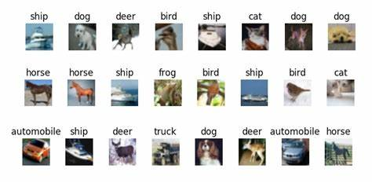
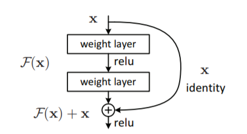
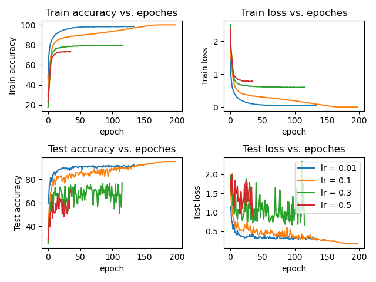
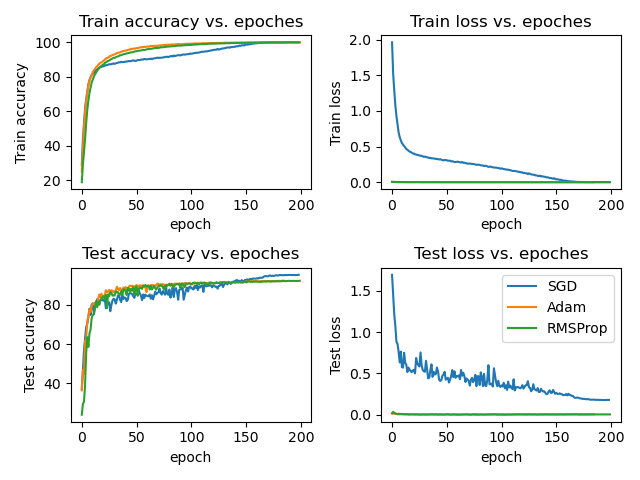
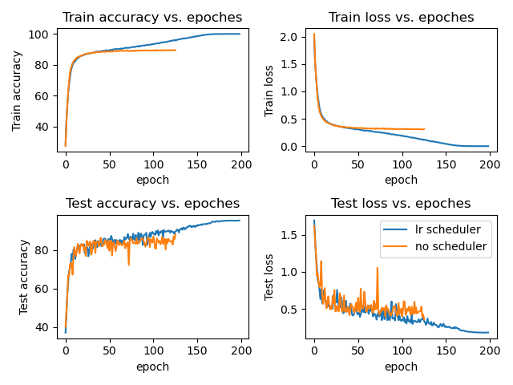

## Description
This is a project training CIFAR-10 using ResNet18. This file records the tuning process on several network parameters and network structure.

### DataSet
#### CIFAR-10
The CIFAR-10 dataset (Canadian Institute For Advanced Research) is a collection of images that are commonly used to train machine learning and computer vision algorithms. It is one of the most widely used datasets for machine learning research. The CIFAR-10 dataset contains 60,000 32x32 color images in 10 different classes. The 10 different classes represent airplanes, cars, birds, cats, deer, dogs, frogs, horses, ships, and trucks. There are 6,000 images of each class.



### Network
#### ResNet18
A residual neural network (ResNet) is an artificial neural network (ANN) of a kind that builds on constructs known from pyramidal cells in the cerebral cortex. Residual neural networks do this by utilizing skip connections, or shortcuts to jump over some layers. Typical ResNet models are implemented with double- or triple- layer skips that contain nonlinearities (ReLU) and batch normalization in between. The structure of the core component Residual Block is as follows.



In this project, we use ResNet18, one of RestNet with 18 depth.

## Installation

Keep reading below for instructions on how to use Pytorch to get the ResNet18 up and running.

### Step 1: Clone the Code from Github
```shell
git clone https://github.com/ShenghaoG/cifar10-resnet18.git
cd cifar10-resnet18
```

### Step 2: Install Requirements
**Python:** see requirement.txt for complete list of used packages. We recommend doing a clean installation of requirements using virtualenv:

```shell
conda create -n pytorchenv python=3.6
conda activate pytorchenv
conda install -r requeirement.txt
```
If you dont want to do the above clean installation via virtualenv, you could also directly install the requirements through:
```shell
pip install -r requirement.txt --no-index
```
**Pytorch**: Note that you need Tensorflow. We used Version 1.5. If you use the above virtualenv, Pytorch will be automatically installed therein.

## Running

### Download Pretrained Networks
```shell
wget "http://47.97.117.176/sources/cifar10-models/ckpt.pth" -P ./chekpoint/
```

### Train the Models
```shell
# Start training with: 
python main.py

# You can manually resume the training with: 
python main.py --resume --lr=0.01
```

## Evaluation
### Learning Rate
We adjust the Learning Rate from 0.01 to 0.5, and observe the network training process. The results are as follows:

| Learning rate | Best Test Acc |
| ---- | ---- |
| 0.0 1| 92.52 |
|0.1|95.37|
|0.3|77.42|
|0.5|70.58|


### Optimizer
We tried 3 optimizers, and observe the network training process. The results are as follows:

| Optimizer | Best Test Acc |
| ---- | ---- |
| SGD| 95.37 |
|Adam|92.42|
|RMSProp|92.34|



### Scheduler
We compared the training with and without scheduler, and observe the network training process. The results are as follows:

| Scheduler | Best Test Acc |
| ---- | ---- |
| Lr Scheduler| 95.37 |
|No Scheduler|88.03|




## License
The code and models are released under the MIT License (refer to the LICENSE file for details).


